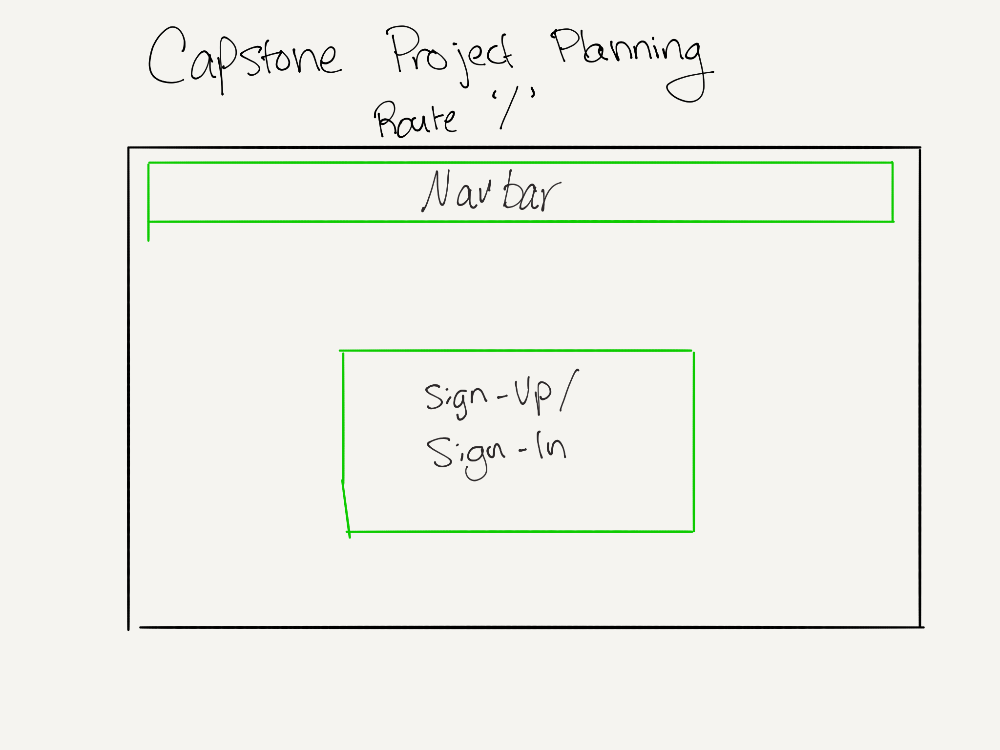
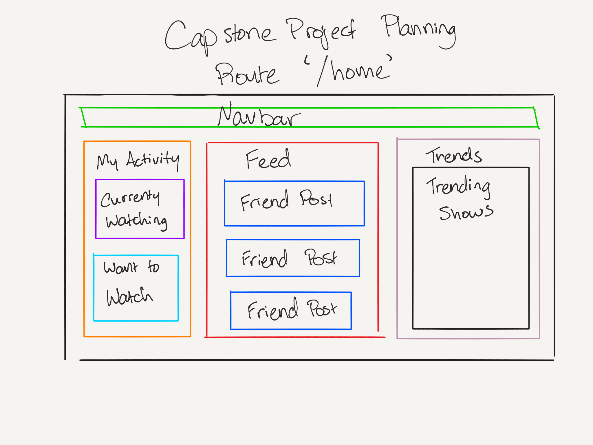
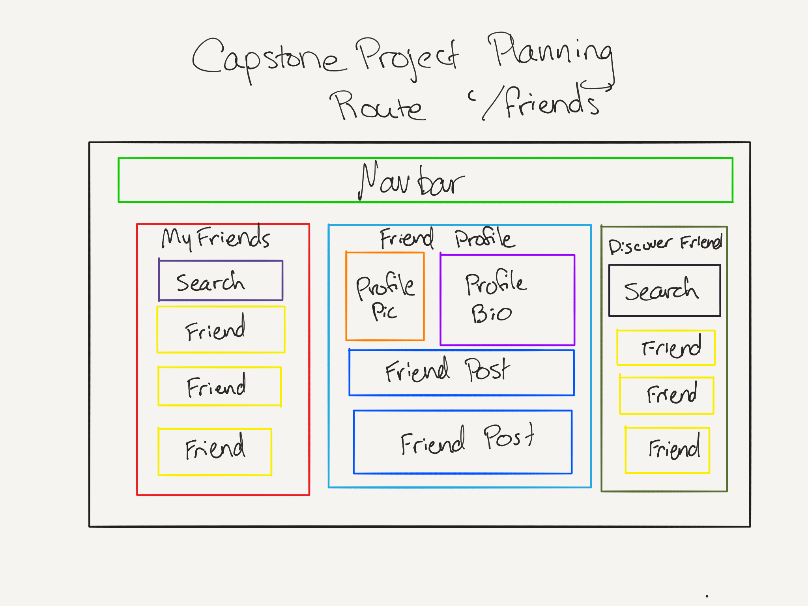

# Capstone Project Planning

#### A repo for planning my Capstone project with Epicodus. 12/7/18

#### By **Chris Crow**

## Description

#### Name of Project: Turvy

#### Project’s Purpose or Goal: (What will it do for users?) 

Share what you’re watching on TV with friends  

#### The absolute minimum features the project requires to meet this purpose or goal:

* Users can log in and create accounts
* Users can select shows that they watch
* Users can add friends and see their friends activities. 

#### What tools, frameworks, libraries, APIs, modules and/or other resources (whatever is specific to your track, and your language) will you use to create this MVP? List them all here. Be specific.

* JavaScript
* React
* Tvmaze api
* Webpack
* Jest
* Babel
* Node
* Bootstrap
* Firebase

#### If you finish developing the minimum viable product (MVP) with time to spare, what will you work on next? Describe these features here: Be specific.

* Add movies possibley
* Add ability to discuss TV show seasons individually
* Add ratings and reviews

#### What additional tools, frameworks, libraries, APIs, or other resources will these additional features require?

* A movie API TBD

### Wire Frame

### References
https://reactjs.org/docs/thinking-in-react.html
<!-- ### Specs
| # | Spec | Input | Output |
| :-------------     | :-------------     | :------------- | :------------- |
| 1 | The program can accept the user input and repeat the order back to the user.  | Medium pizza with all of the toppings except green olives and ham. | Medium pizza with all of the toppings except green olives and ham. |
| 2 | The program can tell the user how much their pizza will cost.  | Pizza Choice | Pizza Cost |
| 3 | The program can display the pizza image as the user makes toppings selections | Select topping | Corresponding image appears | -->

<!-- ## Setup/Installation Requirements

1. Clone this repository.
2. Open the index.html file in your browser of choice.

## Known Bugs
* No known bugs at this time. -->

## Support and Contact Details

_Email chrismcrow@gmail.com._

### License

*none*

Copyright (c) 2018 **_Chris Crow_**
